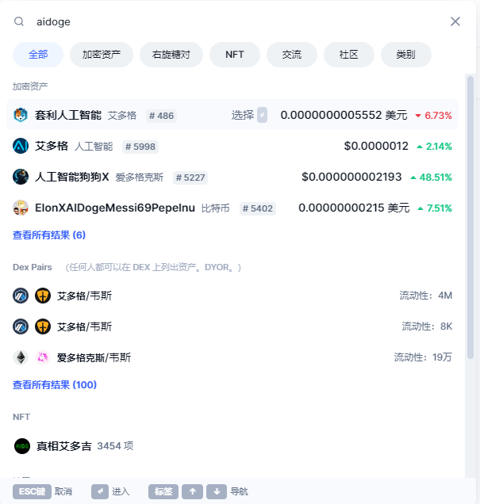

# 第4步：链上土狗暴赚入门


本站由[@qilinhui](https://twitter.com/qilinhui) 维护更新，随时可通过[ bitdong.top](https://z-dong-ge.gitbook.io/copy-of-bi-quan-bai-bao-shu-qi-lin-hui) 访问。


发一个项目，竟然有那么多人问合约、找合约，看来普及一下很有必要。

分四个部分，应该足够用了。

做准备：工具

找金狗：发现

买金狗：入场

卖金狗：离场 以小搏大、咸鱼翻身，从点赞收藏开始吧。

## **一、做准备：工具** 

冲土狗最重要、最常用的。

### 1.两个网站 

[https://coinmarketcap.com](https://coinmarketcap.com/)

[https://coingecko.com/zh](https://coingecko.com/zh)

我简称为：CMC和CGK，结合起来用。

它们类似货币大全，只要知道币的名字，在里面一搜索，就能找到一切准确信息。

而且，能上的项目合约肯定经过了审核 ，更放心！

举例来说，你听人讲 $aidoge 那你想买的话怎么办？不要随便用别人发的合约，万一是假的就完蛋了！

打开上面两个网站中的任意一个，搜索一下，出来了下图。

<figure><figcaption>
<strong>以CMC为例。</strong>
</figcaption></figure>

我在其中进行了标注请仔细看一下！

什么链、合约地址、官网；

市值、全流通市值、24小时交易量、总量

价格、K线。

上面这张图其实还对“能不能买、要不要卖”有一定参考价值，后面展开，先讲完工具。

### 2.K线工具 

再给第二类必备工具，即K线

[https://dexscreener.com](https://dexscreener.com/)

这是一个极为强大的全链浏览器，可以看到各条链上的所有币，由于链上假币横行，推荐新手也用合约地址搜索币，而不是输入名字。

全链浏览器

<figure><figcaption>
全链浏览器
</figcaption></figure>

&#x20;                                           AIDOGE K线和一些数据&#x20;

### 3.去中心化交易所 

第三类工具，即购买，这里坑最多！！

比如，这两天 $aidoge 和 $PEPE 大火，新手在踩坑，被“抢”了很多钱，常见的去 uniswap，机器人很可能会第一时间赶来，让你产生额外损失。

你1万U买，本来能买1万个币的，机器人让你到手只有9千个…

怎么解决？我推荐使用聚合器：

[https://app.1inch.io](https://app.1inch.io/)

这个聚合器也是老牌，支持10多条不同链，自动防夹子，很爽（我曾经被一笔“抢掉”几个ETH才明白这件事……）。

而且这个DEX还支持限价单，我们经常讲土狗要翻倍出本，在UNISWAP不行，但在这里是可以挂一个双倍的价格卖的。

我可以设置为3000U时卖掉我的ETH…

限价单只支持WETH，先转换。

## **二、怎么发现 $aidoge 和 $pepe ？** 

现在进入第二步，网友也有问：bit东是怎么发现 $aidoge 和 $pepe 的呢？

我常用的工具有三个：

### 1.推特 

尤其是国外的资讯。

### 2.电报群 

[https://t.me/BTCdayu999](https://t.me/BTCdayu999)

超活跃，无效信息也多，但好处是什么热点不会错过，相当于2万名玩家在给当我的眼睛。

频道我放了一个词云机器人，扫一眼就知道什么热，比如现在

### 3.followin 

第三个工具就是 [https://followin.io](https://followin.io/) 目前还是内测，网页和APP好像功能不完全一致。

网页有一个热币板块，很容易知道现在推特上热度上升最快的币是什么，以及什么币热度在下降！！

APP的内容很优质，关键是英文区内容翻译给我，能让我快人一步，很爽，每天早上必看。

上面工具中，找金狗的工具，买金狗的DEX和发现金狗的工具都讲了。

## **三、怎么入场、何时离场？** 

接下来就是重头戏，如何运用上述工具判断什么时候还可以冲，什么时候先跑为敬。

### 1.看全流通市值 

MEME币其实都是来得快去得快，关键就是能冲多高？

一般来说，普通的1亿FDV市值；有创新的2亿，特别牛的5亿，极少10亿的。

市值分两类，一是全流通市值，一是流通市值。如下图：OP的流通市值是8亿美元，但全流通是110亿，因为目前释放的代币只占总量的7%。

OP为例

而我上面说的土狗的市值，均建议以FDV来算，也就是全流通市值。

知道上限，就好判断一些东西。以我前两天写的 $PEPE 为例，当时的全流通市值为3700万。

有人说，涨了100倍了，你还叫人接盘？（当场拉黑无脑又无素质的人），其实我观察到：

**一是设计上很赞**，背靠世界第一MEME，无预留、LP销毁等，非常简洁，易于理解。

**二是交易量巨大**，当时链上交易量近1个亿，但市值只有3000万！为什么交易量数倍于市值看涨？这你就可以补一下经典的《量价分析》。

**三是一个交易所都没上**！只要代码没问题，交易量大，二线所必上。

因此，我判断用一些小钱去抓这个机会很值！

因为设计、交易量等我判断上1亿市值很稳，加上还没有上任何一个所，利好待释放，3倍空间值得呀！

上面这些方法论我认为是很珍贵的，很多人不懂，而懂的不一定会教给你。


看市值，而不是听别人瞎讲的多少倍。


实际上，链上的多少倍没有太大价值，因为太早的时候交易量很小，当时根本无法根据量价分析去判断能不能起来，所以早期可能1万U的买单就能涨1000倍，有什么用？

所以，我们买了以后，关键看之后能涨多少！

同样，看市值，你还可以研究怎么卖。

玩家们往往都非常想要冲一个金狗，最好一路再现 $SHIB 的万倍神话，但其实那很难。

因此，冲击到我说的2亿及以上市值时，就要注意一下市场的情绪，观察 [https://followin.io](https://followin.io/) 上的热力指标是否下降，观察交易量是否下降，大盘是否有不稳等。

反之，出现回调时，如果基本面、情绪都还好，市值也不算高，那就拿稳就好。

接下来，补充一个逻辑：永远只冲同类型第一个！

比如 $aidoge 火了，马上出来一些比如 $aishib 之类，网站什么都可能没有，一个代码就让人冲，这种风险极高——明摆着是蹭别人家赶工出来的，你胡乱打钱这就送人头。

离场的方式有两种：

一种是翻倍出本，这适合新手。毕竟只要本金在，就还有机会。

但高手最好不要翻倍出本，因为理论上垃圾项目占大多数。那么，占比少的优秀项目少赚了，而占比多的垃圾项目也没少亏，最后的数学优势其实就不存在了。

最好还是根据我前面讲的去把握离场。充一条，前面使用的交易所部分，偶尔会有一些项目要求特殊，比如 $aidoge ，对在神剑交易所交易有特殊奖励等。

实际上我们可以在CMC的MARKET标签看到代币在哪些地方交易量大——去那交易错不了。

如图，不同交易所还有差价！选便宜的地方。下方的camlot就是指定，点击可以直接访问。

最后，所有这些工具，包括本文（以及本人其他好文、各路研报等），均放在了我的 [bitdong.top](../tou-zi-dao-hang.md)中，你可以直接输入网址随时访问，也可以在我推特置顶随时访问。

觉得有帮助，请去我推特首页点赞[置顶推文。](https://x.com/qilinhui/status/1774691138718593438?t=Sf39LlPoc-VFfck4qJWxjQ\&s=09)

**祝你金狗不断，以小搏大，赚个千把万再说！**

&#x20;[bitdong.top](../tou-zi-dao-hang.md)，随时访问本站。by [@qilinhui](https://twitter.com/qilinhui)
